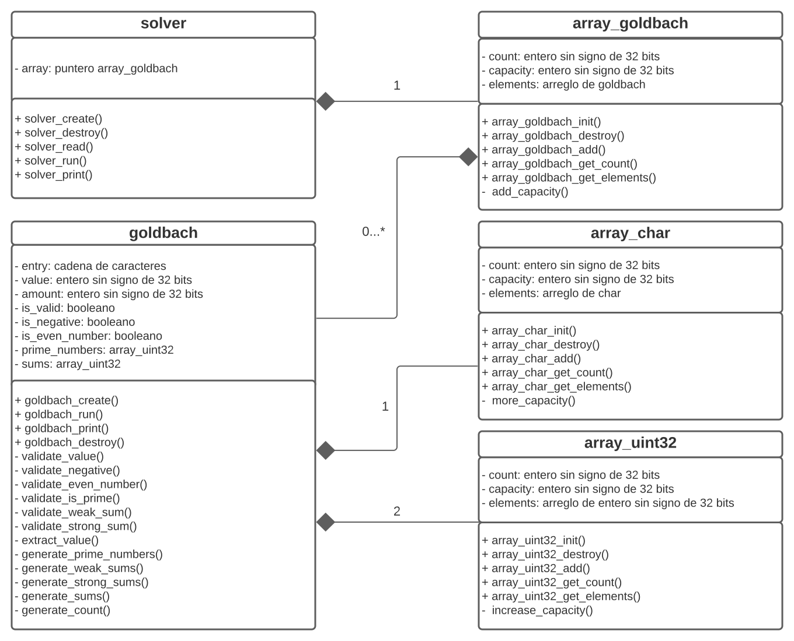
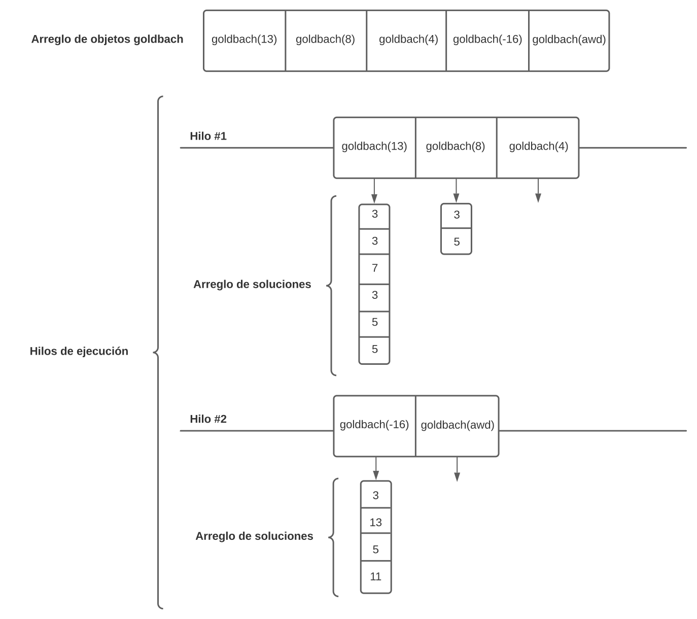

# **Diseño de estructuras de datos**




## Array_char

Esta estructura se encarga del almacenamiento de elementos de tipo char. Se plantea una estructura aparte dedicada para este fin en vez de un arreglo normal para manejar de mejor manera los errores de desbordamiento de memoria como buffer overflow. La estructura de datos se ve implementada en C de la siguiente forma:

```C
typedef struct array_char {
  uint32_t count;
  uint32_t capacity;
  char* elements;
} array_char_t;
```

Esta estructura de datos cuenta con tres campos, en ```count``` se guarda la cantidad de elementos almacenados en la estructura mientras que ```capacity``` guarda la capacidad de elementos que pueden ser almacenados, si se diera la eventual situación de que se llena por completo la capacidad, esta puede ser ampleada. Por otra parte, el campo ```elements``` es un arreglo sencillo el cual guarda los elementos. En el constructor se recibe un objeto de tipo array_char_t cuyos campos estén sin inicializar.

## Array_uint32

Esta estructura se encarga del almacenamiento de elementos de tipo uint32_t. Se plantea una estructura aparte dedicada para este fin en vez de un arreglo normal para manejar de mejor manera los errores de desbordamiento de memoria como buffer overflow. La estructura de datos se ve implementada en C de la siguiente forma:

```C
typedef struct array_uint32 {
  uint32_t count;
  uint32_t capacity;
  uint32_t* elements;
} array_uint32_t;
```

Esta estructura de datos cuenta con tres campos, en ```count``` se guarda la cantidad de elementos almacenados en la estructura mientras que ```capacity``` guarda la capacidad de elementos que pueden ser almacenados, si se diera la eventual situación de que se llena por completo la capacidad, esta puede ser ampleada. Por otra parte, el campo ```elements``` es un arreglo sencillo el cual guarda los elementos. En el constructor se recibe un objeto de tipo array_uint32_t cuyos campos estén sin inicializar.

## Goldbach

Esta estructura se encarga de recibir el valor de entrada y hacer los cálculos correspondientes para brindar las sumas de Goldbach aplicables al valor de entrada. La estructura de datos se ve implementada en C de la siguiente forma:

```C
typedef struct goldbach {
  bool is_valid;
  bool is_negative;
  bool is_even_number;
  uint32_t value;
  uint32_t count;
  array_char_t entry;
  array_uint32_t prime_numbers;
  array_uint32_t sums;
} goldbach_t;
```

En el constructor de goldbach se recibirá unicamente una cadena de caracteres que se almacenará en el campo ```entry```. Después de pasar una serie de validaciones y asegurarse de que es una entrada válida, es decir, un número entero se procede a convertir la cadena en un entero de 32 bits sin signo el cual se almacena en el campo ```value```, en el caso de que el número sea negativo se convierte a positivo para fines de realizar los cálculos.

Al validar la entrada se obtienen los valores correspondientes a ```is_valid```, ```is_negative``` y ```is_even_number```. Es necesaria la existencia de estos campos principalmente porque dependiendo de sus valores se escribirá la salida de una forma u otra.

Esta estructura cuenta además con dos arreglos, ```prime_numbers``` en el cual se llena con todos los números enteros primos existentes hasta el ```value``` y ```sums``` en el cual se almacenan los elementos de las Sumas de Goldbach aplicables al valor dado. Por último la cantidad de Sumas de Goldbach aplicables al valor introducido se guardará en el campo ```count``` de la estructura.

## Array_goldbach

Esta estructura se encarga del almacenamiento de elementos de tipo goldbach_t*. Se plantea una estructura aparte dedicada para este fin en vez de un arreglo normal para manejar de mejor manera los errores de desbordamiento de memoria como buffer overflow. La estructura de datos se ve implementada en C de la siguiente forma:

```C
typedef struct array_goldbach {
  uint32_t count;
  uint32_t capacity;
  goldbach_t** elements;
} array_goldbach_t;
```

Esta estructura de datos cuenta con tres campos, en ```count``` se guarda la cantidad de elementos almacenados en la estructura mientras que ```capacity``` guarda la capacidad de elementos que pueden ser almacenados, si se diera la eventual situación de que se llena por completo la capacidad, esta puede ser ampleada. Por otra parte, el campo ```elements``` es un arreglo sencillo el cual guarda los elementos. En el constructor se recibe un objeto de tipo array_goldbach_t cuyos campos estén sin inicializar.

## Solver

Para recorrer cada archivo introducido y calcular las Sumas de Goldbach para todos los valores contenidos se plantea el uso de un arreglo dinámico. Para cada valor introducido por el usuario se crea un objeto goldbach_t* y se almacena en el campo ```array``` de la estructura. La estructura de datos se ve implementada en C de la siguiente forma:

```C
typedef struct solver {
  array_goldbach_t array;
} solver_t
```

La estructura posee unicamente un campo ```array``` que almacena los objetos goldbach_t* correspondientes a cada valor, esta se crea en el constructor. El método constructor no requiere parámetros.