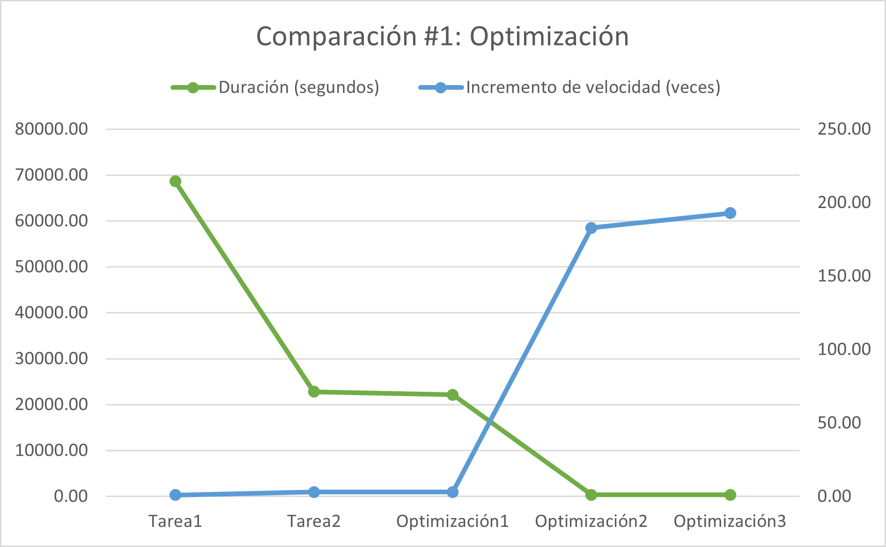

# **Reportes**

## Optimización #1: Implementación de mapeo dinámico

La primera optimización hecha fue la de sustituir el método de mapeo empleado, pasando de utilizar mapeo por bloque a utilizar mapeo dinámico para la repartición de los cálculos entre los hilos. Este mapeo dinámico implenetado sigue el patrón ```productor-consumidor``` donde el hilo principal es el productor y los hilos secundarios los consumidores.

Para seguir el patrón productor-consumidor se decidió usar seguridad condicional, los hilos consumidores trabajan en una celda del arreglo de objetos de tipo ```goldbach_t```, un hilo obtiene el número de celda a trabajar de la variable ```position``` de la estructura de datos compartidos ```solver```, una vez que obtiene el número de celda en el que va a trabajar se incrementa esta misma variable para que otro hilo consumidor no trabaje en una celda donde ya se está trabajando. El programa dejará de repartir celdas del arreglo cuando la variable contadora tenga el mismo valor que el tamaño del arreglo en cuestión. Para evitar condiciones de carrera y demás errores, el proceso de lectura e incremento de la variable contadora se ha protegido con un mutex para que solo un hilo a la vez haga ese proceso.

Después de implementar el mapeo dinamico se obtuvo los siguientes resultados para el caso de prueba [input020.txt](../test/input020.txt):

|                  | goldbach_pthread | Optimización #1  |
|------------------|------------------|------------------|
|Hilos             | 12               | 12               |
|Tiempo            | 22823.12         | 22158.37         |
|Velocidad         | 3.01             | 3.10             |
|Eficiencia        | 0.25             | 0.26             |

Se puede apreciar un incremento aunque pequeño, notorio en la velocidad y eficiencia después de la sustitución del mapeo por bloque por el mapeo dinámico.

## Optimización #2: Eliminación de métodos de validación

Para esta optimización se observó por medio de las herramientas ```callgrind``` y ```kcachegrind``` que los siguientes métedos consumen bastante CPU durante la ejecución del programa:

* ```generate_strong_sums```: 4.73%
* ```generate_weak_sums```: 3.00%
* ```validate_weak_sum```: 2.72%
* ```validate_strong_sum```: 0.38%

En total entre estos cuatro métodos se consume 10.38% de la CPU. Estos datos se pueden corroborar en los siguientes screenshots:


Como también se puede apreciar, en los métodos ```generate_strong_sums``` y ```generate_weak_sums``` se hacen miles de llamdados a los métodos de validación, lo que consume mucha CPU. Por otro lado, dichos métodos de validación hacen que se alarguen los tiempos que tardan los algoritmos de cálculo en ejecutarse, pasando de O(n²) a O(n³) para el caso de conjetura fuerte y de O(n³) a O(n⁴) para la conjetura débil, por lo que se decidió eliminar ```validate_strong_sum``` y ```validate_weak_sum``` y cambiar el algoritmo del cálculo para asegurar que no se repitan sumas de Goldbach.

Después de implementada esta optimización se obtuvo los siguientes resultados para el caso de prueba [input020.txt](../test/input020.txt):

|                  | Optimización #1  | Optimización #2  |
|------------------|------------------|------------------|
|Hilos             | 12               | 12               |
|Tiempo            | 22158.37         | 375.29           |
|Velocidad         | 3.10             | 182.88           |
|Eficiencia        | 0.26             | 15.24            |

Como se puede observar se logró un ingremento gigantesco en la velocidad después de cambiar el ineficiente algoritmo de cálculo y guardado de las sumas de Goldbach.

## Optimizacion #3: Modificación del algoritmo de validación de números primos

En esta tercera optimización se analizó el método ```validate_is_prime``` y se concluyó que el algoritmo utilizado para verificar si el número que se ingresa por parámetro es primo es bastante inefciente y ```kcachegrind``` reveló que era el método que más CPU consumía de todos. Se decidió cambiar el algoritmo incial por el algoritmo de AKS, por lo que este método pasa de tener una complejidad computacional de O(n) inicial a tener una complejidad de 0(logᵏ n).

Después de implementada esta optimización se obtuvo los siguientes resultados para el caso de prueba [input020.txt](../test/input020.txt):

|                  | Optimización #1  | Optimización #2  | Optimización #3  |
|------------------|------------------|------------------|------------------|
|Hilos             | 12               | 12               | 12               |
|Tiempo            | 22158.37         | 375.29           | 355.80           |
|Velocidad         | 3.10             | 182.88           | 192.90           |
|Eficiencia        | 0.26             | 15.24            | 16.07            |

Si bien la optimización #3 no tiene el mismo impacto en el tiempo de ejecución que la optimización #2, su mejoría si es significativa.

## Comparación #1: Optimización

A continuación se presenta una tabla con los distintos datos recabados de ```goldbach_serial```, ```goldbach_pthread```, ```optimización #1```, ```optimización #2``` y ```optimización #3``` para hacer un contraste entre todas las versiones y ver la evolución de la velocidad y eficiencia en cada etapa. Se empleó el caso de prueba [input020.txt](../test/input020.txt) para tomar los datos.

|                  | goldbach_serial  | goldbach_pthread | Optimización #1  | Optimización #2  | Optimización #3  |
|------------------|------------------|------------------|------------------|------------------|------------------|
|Hilos             | 1                | 12               | 12               | 12               | 12               |
|Tiempo            | 68632.47         | 22823.12         | 22158.37         | 375.29           | 355.80           |
|Velocidad         | 1.00             | 3.01             | 3.10             | 182.88           | 192.90           |
|Eficiencia        | 1.00             | 0.25             | 0.26             | 15.24            | 16.07            |

Es evidente que el mayor incremento en la velocidad y la eficiencia del programa se dio en la optimización #2 al replantear el algoritmo de cálculo que era sumamente ineficiente. Estos datos se pueden ver reflejados de mejor manera en los siguientes gráficos:



En este grafico se puede apreciar la importante caída en la duración de ejecución del programa con la tarea #2 que fue donde se implementó la versión concurrente y en la optimización #2 en la que se modificó el ineficiente algoritmo de cálculo y en donde se vió el mayor aumento de velocidad con respecto a la versión serial.


Del anterior gráfico se puede concluir que la eficiencia crece en la misma medida que se da los aumentos de velocidad.

## Comparación #2: Concurrencia

A continuación se muestra una tabla con los datos obtenidos en corridas de ```goldbach_serial``` y ```optimización #3``` con diferentes cantidades de hilos para hacer un contraste entre de la velocidad y la eficiencia de estas versiones en diferentes situaciones. Se usó el caso de prueba [input020.txt](../test/input020.txt) para tomar los datos.

|                  | Serial           | 1                | HC               | 1C               | 2C               | 4C               | D                |
|------------------|------------------|------------------|------------------|------------------|------------------|------------------|------------------|
|Hilos             | 1                | 1                | 6                | 12               | 24               | 48               | 96               |
|Tiempo            | 68632.47         | 1545.78          | 446.09           | 355.80           | 365.12           | 368.77           | 371.32           |
|Velocidad         | 1.00             | 44.40            | 153.85           | 192.90           | 187.97           | 186.11           | 184.83           |
|Eficiencia        | 1.00             | 44.40            | 25.64            | 16.07            | 7.83             | 3.88             | 1.93             |

Esta información se puede observar más claramente en el siguiente gráfico:


Como se puede apreciar en el gráfico el mayor incremento de velocidad se da cuando se trabaja con la cantidad de hilos equivalentes a CPU disponibles, a partir de ahí utilizar más hilos no dará más aumentos de velocidad y por el contrario vuleve menos eficiente el programa sin tener beneficios. Por otro lado, se observa que la versión más cercana al punto de equilibrio entre incremento de velocidad y eficiencia es cuando se utilizan la cantidad de hilos equivalente a la mitad de CPU existentes. ```El punto de óptimo de incremento de velocidad - eficiencia se encuentra al emplear la cantidad de hilos equivalente a un tercio de CPU disponibles```, que para el equipo donde se hicieron las pruebas serían cuatro hilos. [Hoja de cálculo](perfMeasure.xlsx).

## Navegación

* [README principal](../README.md)
* [README del diseño](../design/README.md)